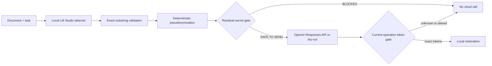

# PII Airlock

[Русская версия](README.ru.md)

PII Airlock is a public, local-first privacy gateway for cloud LLM requests. A local model finds sensitive substrings, deterministic code replaces them with operation-scoped tokens, a second gate checks the exact outgoing payload, and only then may the payload reach OpenAI. The cloud response is untrusted: only exact tokens from the current in-memory mapping can be restored.

This is a demonstrator, not a claim of perfect anonymization. The published benchmark intentionally records misses and blocks unsafe synthetic cases.


## What the demo proves

- Both the task/instructions and document use one local pseudonymization map.
- Raw values and mappings are not logged or persisted by the application.
- Mappings expire after 10 minutes and are deleted after completion, dry-run, or explicit `DELETE`.
- Invalid local JSON, residual high-confidence secrets, existing source tokens, and unknown/altered cloud tokens fail closed.
- Without `OPENAI_API_KEY`, the service shows the exact payload it would send and makes no cloud call.
- The release gate reports zero control-secret leaks among approved payloads on the included 30-case synthetic dataset. This statement applies only to that dataset and run.

## Architecture



See [architecture and threat model](docs/architecture.md) for trust boundaries and non-goals.

## Quick start

Requirements: Python 3.11+, LM Studio listening only on `127.0.0.1:1234`, and either `qwen/qwen3.5-9b` or `google/gemma-4-e4b` installed.

```bash
python3.11 -m venv .venv
source .venv/bin/activate
pip install -e '.[dev]'
pii-airlock serve
```

Open `http://127.0.0.1:8787`. Dry-run is the default. To opt into cloud processing, copy `.env.example`, export `OPENAI_API_KEY`, and restart the local process. The OpenAI call uses the Responses endpoint with `store: false`; your account and provider policies still apply.

Official protocol references: [LM Studio structured output](https://lmstudio.ai/docs/developer/openai-compat/structured-output), [LM Studio server settings](https://lmstudio.ai/docs/developer/core/server/settings), and [OpenAI latest model guide](https://developers.openai.com/api/docs/guides/latest-model).

## CLI

```bash
pii-airlock inspect document.docx --model qwen
pii-airlock complete document.pdf --task "Summarize" --model gemma
pii-airlock benchmark --models qwen,gemma --output docs/evaluation/latest.json
```

Supported V1 inputs: pasted text, `.txt`, `.md`, `.docx`, and PDF with a text layer. OCR, images, archives, files over 5 MB, and extracted text over 20,000 characters are rejected.

## Local API

| Method | Path | Purpose |
|---|---|---|
| `GET` | `/api/v1/health` | LM Studio reachability, available model IDs, cloud configuration flag |
| `POST` | `/api/v1/operations` | Analyze and return sanitized preview |
| `POST` | `/api/v1/operations/{id}/complete` | Dry-run or cloud round trip and restoration |
| `DELETE` | `/api/v1/operations/{id}` | Destroy mapping now |
| `POST` | `/api/v1/complete` | Synchronous adapter endpoint for agents such as Gosha |

## Reproducible evidence

The repository contains 15 Russian and 15 English synthetic cases. Final live results are in [the comparison report](docs/evaluation/model-comparison.md) and machine-readable JSON files under `docs/evaluation/`. Offline tests use stubs and require neither LM Studio nor API keys:

```bash
pytest
python -m compileall -q src tests
```

## Limits

Local model recall is imperfect. Deterministic rules cover selected high-confidence formats, not every name, address, organization, or secret. A prompt injection inside the document can influence a weak local model despite the data delimiters; exact-substring validation limits fabrication but does not guarantee complete detection. Use dry-run and human review for high-risk documents. See [SECURITY.md](SECURITY.md).

## Case study and submission artifacts

- [English case study](docs/case-study.en.md)
- [Russian case study](docs/case-study.ru.md)
- [Model comparison](docs/evaluation/model-comparison.md)
- [Gosha adapter contract](docs/gosha-integration.md)

MIT licensed.
