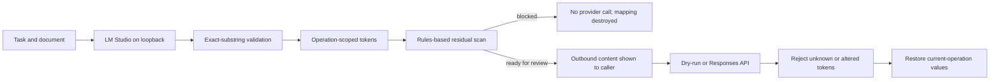

# PII Airlock

[Русская версия](README.ru.md)

PII Airlock is a small local gateway for testing pseudonymization before a cloud-model call. LM Studio proposes sensitive substrings; Python code verifies that every proposed value occurs in the input, replaces it with an operation-scoped token, and runs a second rules-based scan. The provider response is accepted only if every PII-like token belongs to that operation.

The project does not determine that a document is safe. Its runtime checks missed known controls in the published synthetic run. The Web UI therefore uses `READY_FOR_REVIEW`, not `SAFE_TO_SEND`, and cloud access is off until both an API key and a model are configured.


## Data flow



The mapping is held in memory for at most ten minutes. A completed, failed, expired, deleted, or blocked operation loses its mapping. The HTTP app rejects non-loopback clients even if it is accidentally started on an external interface.

## Run locally

Requirements: Python 3.11+ and LM Studio listening on `127.0.0.1:1234`. Load one of these local model IDs:

- `qwen/qwen3.5-9b`
- `google/gemma-4-e4b`

```bash
git clone https://github.com/AI-Danil/pii-airlock.git
cd pii-airlock
python3.11 -m venv .venv
source .venv/bin/activate
python -m pip install -e '.[dev]'
pii-airlock serve
```

Open `http://127.0.0.1:8787`. With no cloud configuration, completion ends as a dry-run and shows the provider-bound `instructions` and `input_text`.

To enable an OpenAI call, set both variables explicitly:

```bash
export OPENAI_API_KEY='...'
export OPENAI_MODEL='model-available-to-your-account'
pii-airlock serve
```

The client calls `POST /v1/responses` with `store: false`. This request setting does not replace the provider and account data policies. The project intentionally has no hard-coded cloud model default because model availability changes.

Protocol references: [LM Studio structured output](https://lmstudio.ai/docs/developer/openai-compat/structured-output), [LM Studio server settings](https://lmstudio.ai/docs/developer/core/server/settings), and the [OpenAI Responses API reference](https://developers.openai.com/api/reference/resources/responses/methods/create).

## CLI

```bash
pii-airlock inspect document.docx --model qwen
pii-airlock complete document.pdf --task "Summarize" --model gemma
pii-airlock benchmark --models qwen,gemma --output docs/evaluation/live-combined.json
```

V1 reads pasted text, TXT, Markdown, DOCX, and PDFs with a text layer. OCR, images, archives, and inputs above 20,000 extracted characters are rejected. DOCX expansion is capped at 25 MB; PDFs are capped at 100 pages.

## Local API

| Method | Route | Purpose |
|---|---|---|
| `GET` | `/api/v1/health` | LM Studio reachability, advertised model IDs, cloud configuration flag |
| `POST` | `/api/v1/operations` | Detect, pseudonymize, and return reviewable outbound content |
| `POST` | `/api/v1/operations/{id}/complete` | Run dry-run/provider call and destroy the mapping |
| `DELETE` | `/api/v1/operations/{id}` | Destroy the operation immediately |
| `POST` | `/api/v1/complete` | Stateless path used by an assistant integration |

`READY_FOR_REVIEW` means that the implemented deterministic checks found no residual value they recognize. It is not an approval decision. API callers are responsible for their own review or policy gate.

## Published run: 20 July 2026

The repository contains 30 synthetic cases: 15 Russian and 15 English. No cloud request was made during the benchmark.

| Metric | Qwen 3.5 9B | Gemma 4 E4B |
|---|---:|---:|
| Entity recall | 0.7037 | 0.7593 |
| Extra replacement values | 5 | 4 |
| Detection failures | 4 | 0 |
| Runtime gate passes | 23 | 26 |
| Known-control leaks after runtime gate | 0 | 4 |
| Fixture-oracle passes | 23 | 22 |
| Median latency | 1.948 s | 1.014 s |
| Maximum latency | 4.152 s | 15.628 s |

All four Qwen detection failures were exact-substring violations, not JSON-schema failures. The runtime gate caught every known Qwen control in this run but missed four Gemma cases. The fixture oracle withheld those four payloads because it knew the expected labels; such an oracle cannot protect an arbitrary document. Both local models remain experimental.

See the [comparison note](docs/evaluation/model-comparison.md) and [machine-readable run](docs/evaluation/live-combined.json).

## Security limits

Rules cover selected email, phone, payment-card, key, passport, tax-ID, contract-ID, and labelled-secret formats. They do not cover every name, address, organization, identifier, or credential. A local model can miss an entity or follow an instruction embedded in a document. Exact-substring validation prevents invented replacements; it does not improve recall.

Use synthetic data while evaluating the project. For real high-risk documents, keep cloud disabled and use an independently reviewed policy and detector set. See [SECURITY.md](SECURITY.md) and the [architecture and threat model](docs/architecture.md).

## Development checks

```bash
pytest
ruff check .
ruff format --check .
python -m compileall -q src tests
```

GitHub Actions runs these checks with stubs. LM Studio and provider credentials are not used in CI.

MIT License.
