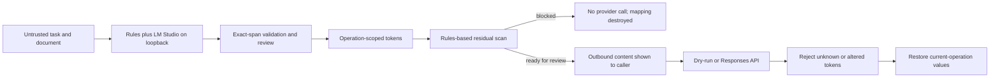

# PII Airlock

[Русская версия](README.ru.md)

PII Airlock is a small local gateway for testing pseudonymization before a cloud-model call. Deterministic rules and LM Studio propose sensitive substrings; Python code maps Unicode-obfuscated rule matches back to exact source spans, validates model proposals, replaces only selected spans with operation-scoped tokens, and scans the result again. The provider response is accepted only if every PII-like token belongs to that operation and appears no more often than it did in the request.

The project does not determine that a document is safe. Its runtime checks missed known controls in the published synthetic run. The Web UI therefore uses `READY_FOR_REVIEW`, not `SAFE_TO_SEND`, and cloud access is off until both an API key and a model are configured.


## Data flow



The mapping is held in memory for at most ten minutes. One background sweeper removes expired mappings without waiting for another request, and the store accepts at most 100 pending operations. Completion atomically claims an operation, so the guarantee is **at most one** provider attempt: a failed attempt is not retried automatically. The HTTP app also validates the loopback client and `Host`; browser writes require an HttpOnly session cookie and same origin.

## Run locally

Requirements: Python 3.11+ and LM Studio listening on `127.0.0.1:1234`. Load one of these local model IDs:

- `qwen/qwen3.5-9b`
- `google/gemma-4-e4b`

```bash
git clone https://github.com/AI-Danil/pii-airlock.git
cd pii-airlock
python3.11 -m venv .venv
source .venv/bin/activate
python -m pip install -e '.[dev]'
pii-airlock serve
```

Machine clients must also set a random API token. The stateless route is disabled when this value is empty:

```bash
export PII_AIRLOCK_API_TOKEN="$(openssl rand -hex 32)"
pii-airlock serve
```

Set the token before starting the process. Machine clients send the same value as `Authorization: Bearer <token>`.

Open `http://127.0.0.1:8787`. With no cloud configuration, completion ends as a dry-run and shows the provider-bound `instructions` and `input_text`.

To enable an OpenAI call, set both variables explicitly:

```bash
export OPENAI_API_KEY='...'
export OPENAI_MODEL='model-available-to-your-account'
pii-airlock serve
```

The client calls `POST /v1/responses` with `store: false`. This request setting does not replace the provider and account data policies. The project intentionally has no hard-coded cloud model default because model availability changes.

Protocol references: [LM Studio structured output](https://lmstudio.ai/docs/developer/openai-compat/structured-output), [LM Studio server settings](https://lmstudio.ai/docs/developer/core/server/settings), and the [OpenAI Responses API reference](https://developers.openai.com/api/reference/resources/responses/methods/create).

## CLI

```bash
pii-airlock inspect document.docx --model qwen
pii-airlock complete document.pdf --task "Summarize" --model gemma
pii-airlock benchmark --models qwen,gemma --timeout 30 --output docs/evaluation/live-combined.json
```

V1 reads pasted text, TXT, Markdown, DOCX, and PDFs with a text layer. OCR, images, archives, and inputs above 20,000 extracted characters are rejected. DOCX expansion is capped at 25 MB; PDFs are capped at 100 pages.

## Local API

| Method | Route | Purpose |
|---|---|---|
| `GET` | `/api/v1/health` | LM Studio reachability and boolean configuration flags; no secrets |
| `POST` | `/api/v1/operations` | Detect, pseudonymize, and return reviewable outbound content |
| `PATCH` | `/api/v1/operations/{id}/redactions` | Confirm, add, remove, or retag exact source spans before completion |
| `POST` | `/api/v1/operations/{id}/complete` | Run dry-run/provider call and destroy the mapping |
| `DELETE` | `/api/v1/operations/{id}` | Destroy the operation immediately |
| `POST` | `/api/v1/complete` | Bearer-only stateless path; disabled without `PII_AIRLOCK_API_TOKEN` |

The Web UI gets a random HttpOnly, SameSite=Strict session cookie. Its state-changing requests also require an exact same-origin `Origin`. A valid bearer token can call state-changing routes without a browser session. Requests above 5 MiB + 64 KiB are rejected before document parsing. `READY_FOR_REVIEW` means only that the implemented checks found no residual value they recognize.

## Published run: 21 July 2026

The repository contains 52 synthetic cases: 26 Russian and 26 English. Six are clean controls and 20 are tagged adversarial cases, including Unicode/zero-width obfuscation, split contact values, and prompt-like instructions. No cloud request was made during the benchmark. The original 30-case numbers are not directly comparable: the fixture set was expanded and four incorrect oracle spans were corrected before this run.

| Metric | Qwen 3.5 9B | Gemma 4 E4B |
|---|---:|---:|
| Entity recall | 0.8472 | 0.8056 |
| Entity precision | 0.8243 | 0.9062 |
| Extra replacement values | 9 | 4 |
| Detection failures | 11 | 0 |
| Runtime gate passes | 32 | 42 |
| Known-control leaks after runtime gate | 0 | 9 |
| Fixture-oracle passes | 32 | 33 |
| Fixture-assisted review projection | 42 | 42 |
| Median latency | 11.053 s | 2.799 s |
| Maximum latency | 20.860 s | 14.254 s |

Qwen produced 11 non-exact model proposals. The hybrid detector now preserves deterministic rule spans in those cases, but automatic completion remains blocked until a person confirms or edits the spans. Gemma produced no structured-output failure, yet nine payloads that passed the runtime gate still contained a labelled value. The fixture oracle stopped those nine only because it knew the answers. `Fixture-assisted review projection` applies fixture labels as if they were manual edits; it is not a measured human-review result. Both local models remain experimental.

See the [comparison note](docs/evaluation/model-comparison.md) and [machine-readable run](docs/evaluation/live-combined.json).

## Security limits

Rules cover selected email, phone, payment-card, key, passport, tax-ID, contract-ID, and labelled-secret formats, including several whitespace and Unicode obfuscations. They do not cover every name, address, organization, identifier, credential, or visual confusable. A local model can miss an entity or follow an instruction embedded in a document. Prompt-like source text is visibly flagged; the unattended stateless route blocks it. Delimiting untrusted content reduces instruction confusion but is not a sandbox. Exact-substring validation prevents invented replacements; it does not improve recall.

Use synthetic data while evaluating the project. For real high-risk documents, keep cloud disabled and use an independently reviewed policy and detector set. See [SECURITY.md](SECURITY.md) and the [architecture and threat model](docs/architecture.md).

## Development checks

```bash
pytest
ruff check .
ruff format --check .
python -m compileall -q src tests
python scripts/scan_secrets.py
```

The offline suite currently contains 88 tests. GitHub Actions runs it on Python 3.11 and 3.12 with stubs. Separate workflows audit locked runtime dependencies, generate a CycloneDX SBOM, and attest tagged release artifacts. LM Studio and provider credentials are not used in CI.

MIT License.
