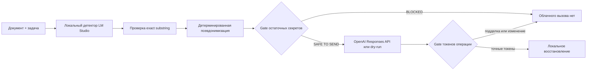

# PII Airlock

[English version](README.md)

PII Airlock — публичный локальный privacy-gateway для запросов к облачным LLM. Локальная модель находит чувствительные подстроки, детерминированный код заменяет их токенами конкретной операции, отдельный gate проверяет фактический исходящий payload, и только после этого payload может уйти в OpenAI. Ответ облака считается недоверенным: восстанавливаются только точные токены из текущей mapping в памяти.

Это демонстрационный проект, а не обещание абсолютной анонимности. Опубликованный benchmark честно фиксирует пропуски моделей и блокирует небезопасные синтетические кейсы.


## Что доказывает демо

- Инструкция и документ проходят через одну локальную карту псевдонимизации.
- Сырые значения и mapping не пишутся приложением в логи или на диск.
- Mapping живёт до 10 минут и удаляется после ответа, dry-run или явного `DELETE`.
- Невалидный JSON локальной модели, остаточный явный секрет, PII-токен во входе и неизвестный/изменённый токен из облака приводят к fail-closed блокировке.
- Без `OPENAI_API_KEY` сервис показывает точный cloud payload и не обращается в облако.
- На включённом наборе из 30 синтетических документов среди разрешённых payload нет контрольных секретов. Это граница доказательства только данного набора и запуска.

## Схема



Границы доверия и угрозы: [архитектура и threat model](docs/architecture.ru.md).

## Быстрый запуск

Нужны Python 3.11+, LM Studio на `127.0.0.1:1234` и установленная модель `qwen/qwen3.5-9b` или `google/gemma-4-e4b`.

```bash
python3.11 -m venv .venv
source .venv/bin/activate
pip install -e '.[dev]'
pii-airlock serve
```

Откройте `http://127.0.0.1:8787`. По умолчанию работает dry-run. Для добровольного облачного вызова экспортируйте `OPENAI_API_KEY`. Запрос использует Responses API и `store: false`, но политики вашей учётной записи и провайдера продолжают действовать.

Официальные протоколы: [structured output LM Studio](https://lmstudio.ai/docs/developer/openai-compat/structured-output), [настройки сервера LM Studio](https://lmstudio.ai/docs/developer/core/server/settings), [руководство OpenAI по моделям](https://developers.openai.com/api/docs/guides/latest-model).

## CLI

```bash
pii-airlock inspect document.docx --model qwen
pii-airlock complete document.pdf --task "Сделай краткое резюме" --model gemma
pii-airlock benchmark --models qwen,gemma --output docs/evaluation/latest.json
```

V1 принимает текст, `.txt`, `.md`, `.docx` и PDF с текстовым слоем. OCR, изображения, архивы, файлы больше 5 МБ и извлечённый текст длиннее 20 000 символов блокируются.

## Локальный API

| Метод | Путь | Назначение |
|---|---|---|
| `GET` | `/api/v1/health` | Доступность LM Studio, модели и флаг облачной конфигурации |
| `POST` | `/api/v1/operations` | Анализ и обезличенный preview |
| `POST` | `/api/v1/operations/{id}/complete` | Dry-run/облачный цикл и восстановление |
| `DELETE` | `/api/v1/operations/{id}` | Немедленно уничтожить mapping |
| `POST` | `/api/v1/complete` | Синхронный адаптер для агентов, включая Гошу |

## Доказательства

В репозитории 15 русских и 15 английских синтетических кейсов. Итоги живых запусков — в [сравнении моделей](docs/evaluation/model-comparison.ru.md) и JSON под `docs/evaluation/`. Offline-тесты не требуют LM Studio и ключей:

```bash
pytest
python -m compileall -q src tests
```

## Ограничения

Recall локальных моделей несовершенен. Детерминированные правила закрывают выбранные форматы, но не все имена, адреса, организации и секреты. Prompt injection внутри документа может повлиять на слабую локальную модель; exact-substring validation ограничивает выдуманные значения, но не гарантирует полноту. Для рискованных документов нужен dry-run и человеческая проверка. Подробнее: [SECURITY.md](SECURITY.md).

## Материалы кейса

- [Кейс на русском](docs/case-study.ru.md)
- [Case study in English](docs/case-study.en.md)
- [Сравнение моделей](docs/evaluation/model-comparison.ru.md)
- [Контракт адаптера Гоши](docs/gosha-integration.md)

Лицензия MIT.
