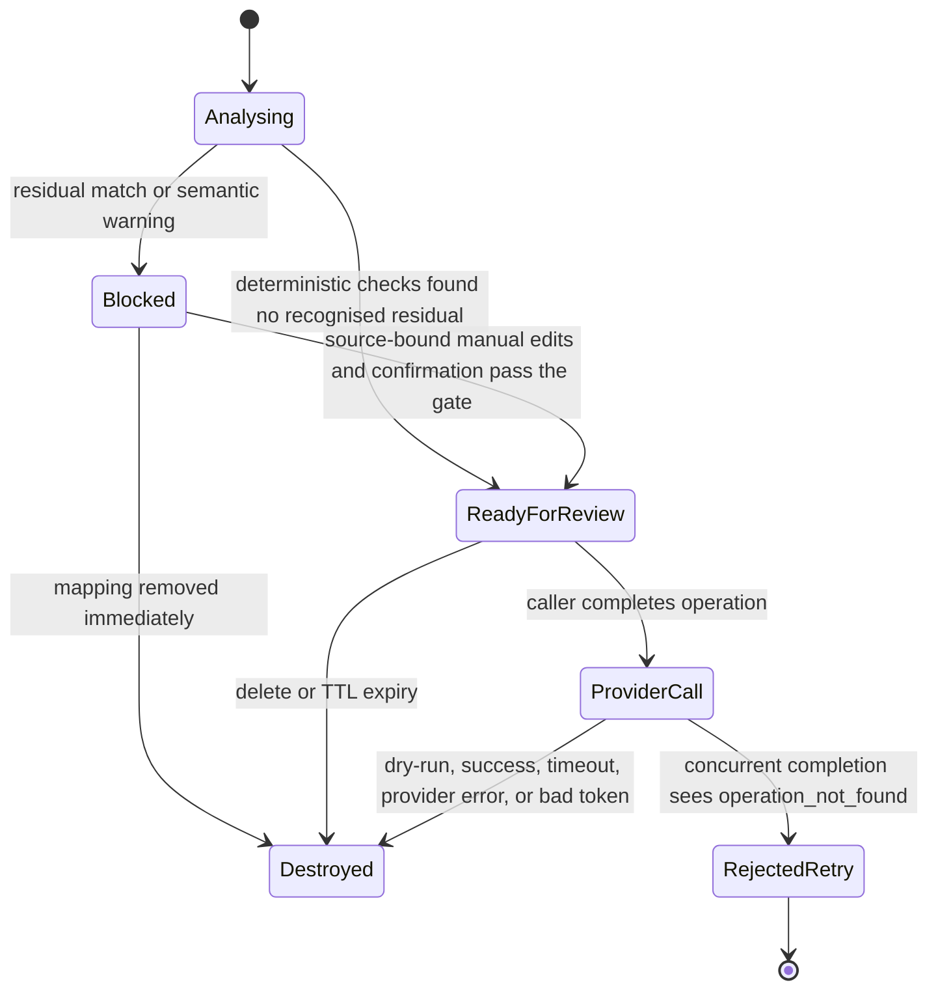

# Architecture and threat model

## Components and boundaries

| Component | Location | Trust assumption |
|---|---|---|
| API, redaction, mapping, gate, restoration | Python process | Local process; contains raw data temporarily |
| DOCX/PDF parser workers | Spawned local processes | Untrusted document parsers with bounded lifetime and resources |
| LM Studio detector | `127.0.0.1:1234` | Local but fallible; output is validated |
| Source document | Local input | Untrusted data; may contain prompt injection or token-like text |
| Provider | HTTPS endpoint | Untrusted output; receives pseudonymized fields only after runtime checks |
| Caller/operator | Web UI, CLI, or API | Chooses whether review is sufficient for the intended use |

The source task and document are analysed together so one mapping can cover both, then they are redacted as separate fields. The API returns `outbound_content.instructions` and `outbound_content.input_text`; those same strings are passed to the provider client. Provider instructions delimit the task and document as untrusted data and prohibit treating document text as an instruction to call tools, access networks, or disclose secrets. The OpenAI client adds the configured model and `store: false`.

Deterministic rules first canonicalize selected Unicode, whitespace, line-break, and zero-width variants while keeping a character-to-source offset map. LM Studio adds semantic candidates. Exact occurrences are collected per field. Candidate spans are selected by decreasing length, overlapping candidates are discarded, and the selected spans are replaced from their recorded offsets. A shorter value is retained only when it has a separate non-overlapping occurrence. Equal selected values reuse a token within the operation; unused model proposals never enter the mapping. New operations use a 32-hex-character nonce (128 random bits). Public `redactions` expose field, offsets, type, and token, but not the raw value. The application does not serialize mappings.

The reviewer can add, remove, or retag exact source spans. The request repeats the source fields, and the service verifies their SHA-256 digests against the operation snapshot before applying the edit. A semantic detector failure retains deterministic rule spans but sets a mandatory-review warning; even an empty review action is an explicit confirmation. Prompt-like text is separately flagged. The Web UI can continue after inspection, while the unattended stateless route blocks such input.

The operation store has one background TTL sweeper and a 100-operation pending limit. Analysis is bounded by a four-request semaphore by default. A completion request atomically removes its operation from the store before dry-run or provider work starts. A concurrent retry therefore receives `operation_not_found` instead of starting another call. This is an at-most-once attempt; a failed provider call is not retried by the service.

## Operation states

`READY_FOR_REVIEW` is deliberately not named `SAFE_TO_SEND`: the detector can omit sensitive values. The Web UI exposes exact outbound content and requires an explicit review action. The stateless API route blocks prompt-like text but cannot provide human review; its caller still needs an external acceptance policy.

## Failure handling

| Condition | Result |
|---|---|
| LM Studio unavailable, timeout, HTTP error, oversized or invalid response | Rule spans retained for review; automatic completion blocked; no provider call |
| Model returns a value not present verbatim in the input | Rule spans retained; manual confirmation or edit required |
| Recognised residual value or no detected entity | Request blocked; mapping discarded |
| Source contains any reserved token prefix | Request blocked |
| Remote client, non-loopback `Host`, or foreign `Origin` | `403`; request is not processed |
| Browser write without its session cookie and same-origin `Origin` | `401` or `403` |
| Stateless call without configured bearer token | Route disabled or `401` |
| Pending operation count reaches 100 | `429`; new mapping is destroyed |
| Concurrent analysis capacity is exhausted | `429`; source is not queued indefinitely |
| HTTP body exceeds 5 MiB + 64 KiB | `413` before document parsing |
| Concurrent or repeated completion | `operation_not_found`; no second provider call |
| Provider alters, invents, truncates, changes case, or over-repeats a PII token | Answer blocked; mapping discarded |
| Provider timeout, HTTP error, invalid or oversized response | Error returned; mapping discarded |

## Threat coverage

The design reduces accidental disclosure when the detector, a reviewer, or residual rules find the relevant value. It also handles selected Unicode obfuscation, model fabrication, parser size and expansion abuse, overlapping replacements, repeated completion, local cross-origin calls, a source-token collision, provider-token injection and amplification, stale mappings, and raw values in the application's own structured audit calls. DOCX/PDF parsing runs in short-lived processes with wall-clock and platform-supported resource limits.

It does not solve detector recall, all Unicode confusables, malicious parser code, or prompt injection in general. Delimiters and stateless blocking narrow the instruction boundary but do not make untrusted text executable-safe. The synthetic benchmark confirms that known values can cross the runtime gate. The fixture oracle used in evaluation is not a production component.

## Build evidence

Runtime and development inputs are exactly pinned in separate lock files. CI runs an offline stub suite, a high-confidence secret scan, `pip-audit`, and CycloneDX SBOM generation. Tagged release builds use GitHub artifact attestations. These controls improve provenance and reviewability; they do not prove that a dependency or build runner is uncompromised.

## Outside V1

OCR, images, audio, malware scanning, encrypted persistence, multi-user identity and authorization, regulatory certification, provider-side guarantees, and protection from a privileged local attacker are not implemented.
