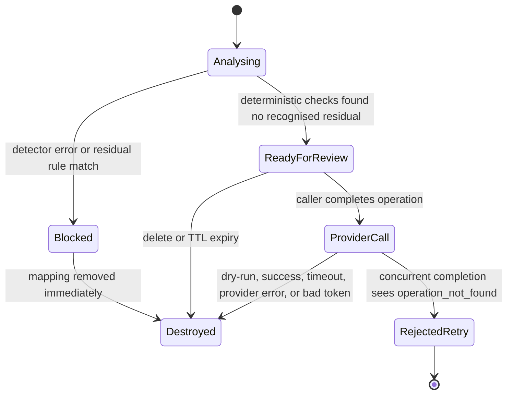

# Architecture and threat model

## Components and boundaries

| Component | Location | Trust assumption |
|---|---|---|
| File parser, redaction, mapping, gate, restoration | Python process | Local process; contains raw data temporarily |
| LM Studio detector | `127.0.0.1:1234` | Local but fallible; output is validated |
| Source document | Local input | Untrusted data; may contain prompt injection or token-like text |
| Provider | HTTPS endpoint | Untrusted output; receives pseudonymized fields only after runtime checks |
| Caller/operator | Web UI, CLI, or API | Chooses whether review is sufficient for the intended use |

The source task and document are analysed together so one mapping can cover both, then they are redacted as separate fields. The API returns `outbound_content.instructions` and `outbound_content.input_text`; those same strings are passed to the provider client. The OpenAI client adds the configured model and `store: false`.

Exact occurrences are collected per field. Candidate spans are selected by decreasing length, overlapping candidates are discarded, and the selected spans are replaced from their recorded offsets. A shorter value is retained only when it has a separate non-overlapping occurrence. Equal selected values reuse a token within the operation; unused model proposals never enter the mapping. New operations use a 32-hex-character nonce (128 random bits). Public `redactions` expose field, offsets, type, and token, but not the raw value. The application does not serialize mappings.

The operation store has one background TTL sweeper and a 100-operation pending limit. A completion request atomically removes its operation from the store before dry-run or provider work starts. A concurrent retry therefore receives `operation_not_found` instead of starting another call.

## Operation states

`READY_FOR_REVIEW` is deliberately not named `SAFE_TO_SEND`: the detector can omit sensitive values. The Web UI requires an explicit review action. The stateless API route is automated, so its caller must supply an external policy if human review is required.

## Failure handling

| Condition | Result |
|---|---|
| LM Studio unavailable, timeout, HTTP error, oversized or invalid response | Request blocked; no provider call |
| Model returns a value not present verbatim in the input | Request blocked |
| Recognised residual value or no detected entity | Request blocked; mapping discarded |
| Source contains any reserved token prefix | Request blocked |
| Remote client, non-loopback `Host`, or foreign `Origin` | `403`; request is not processed |
| Browser write without its session cookie and same-origin `Origin` | `401` or `403` |
| Stateless call without configured bearer token | Route disabled or `401` |
| Pending operation count reaches 100 | `429`; new mapping is destroyed |
| HTTP body exceeds 5 MiB + 64 KiB | `413` before document parsing |
| Concurrent or repeated completion | `operation_not_found`; no second provider call |
| Provider alters, invents, truncates, or changes case of a PII token | Answer blocked; mapping discarded |
| Provider timeout, HTTP error, invalid or oversized response | Error returned; mapping discarded |

## Threat coverage

The design reduces accidental disclosure when the detector and residual rules find the relevant value. It also handles model fabrication, parser size abuse, overlapping replacements, repeated completion, local cross-origin calls, a source-token collision, provider-token injection, stale mappings, and raw values in the application's own structured audit calls.

It does not solve detector recall. The synthetic benchmark confirms that known values can cross the runtime gate. The fixture oracle used in evaluation is not a production component.

## Outside V1

OCR, images, audio, malware scanning, encrypted persistence, multi-user identity and authorization, regulatory certification, provider-side guarantees, and protection from a privileged local attacker are not implemented.
