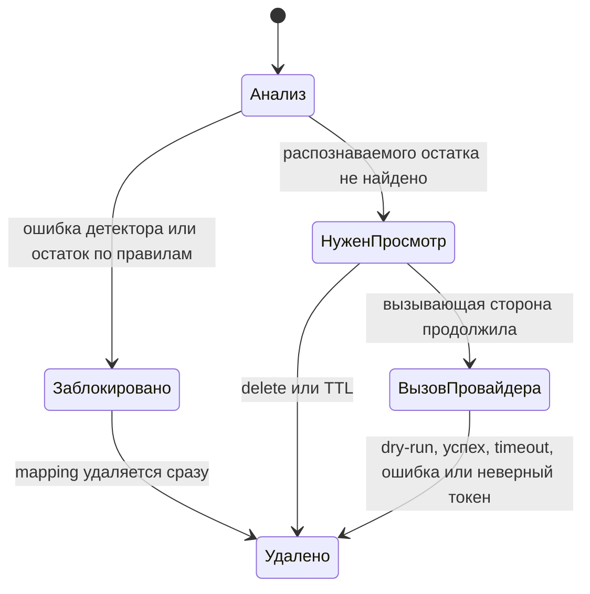

# Архитектура и модель угроз

## Компоненты и границы

| Компонент | Где работает | Допущение |
|---|---|---|
| Парсер, замена, mapping, gate, восстановление | Python-процесс | Локальный процесс; временно содержит исходные данные |
| Детектор LM Studio | `127.0.0.1:1234` | Локальный, но ошибается; его вывод проверяется |
| Исходный документ | Локальный вход | Недоверенные данные; возможны prompt injection и строки, похожие на токены |
| Провайдер | HTTPS endpoint | Ответ недоверенный; получает псевдонимизированные поля после runtime-проверок |
| Пользователь или вызывающий код | Web UI, CLI или API | Определяет, достаточна ли проверка для конкретного сценария |

Задача и документ анализируются вместе, чтобы одна mapping покрывала оба поля, а заменяются отдельно. API возвращает `outbound_content.instructions` и `outbound_content.input_text`; те же строки получает клиент провайдера. OpenAI-клиент добавляет явно настроенную модель и `store: false`.

Значения сортируются от длинных к коротким. Одинаковое значение использует один токен внутри операции. Новая операция получает nonce из 32 hex-символов — 128 случайных бит. Код приложения не сериализует mapping.

## Состояния операции

Статус называется `READY_FOR_REVIEW`, а не `SAFE_TO_SEND`: детектор может пропустить чувствительное значение. Web UI требует отдельного действия после просмотра. Stateless API работает автоматически, поэтому при обязательном human review вызывающий код должен добавить внешнюю политику.

## Обработка сбоев

| Условие | Результат |
|---|---|
| LM Studio недоступна, timeout, HTTP-ошибка, слишком большой или невалидный ответ | Блокировка; провайдер не вызывается |
| Модель вернула значение, которого нет во входе как точной подстроки | Блокировка |
| Распознаваемый остаток или не найдено ни одной сущности | Блокировка; mapping удаляется |
| Во входе есть любой reserved token prefix | Блокировка |
| HTTP-клиент не loopback | `403`; запрос не обрабатывается |
| Провайдер изменил, придумал или обрезал PII-токен | Ответ блокируется; mapping удаляется |
| Timeout, HTTP-ошибка, невалидный или слишком большой ответ провайдера | Ошибка наружу; mapping удаляется |

## Что покрыто

Схема снижает вероятность случайной передачи, когда детектор или правила нашли нужное значение. Также обработаны выдуманное моделью значение, атака размером на парсер, конфликт с готовым токеном, token injection в ответе, просроченная mapping и попадание исходного текста в собственные audit-вызовы приложения.

Полнота детектора не решена. Синтетический benchmark подтвердил, что известные значения могут пройти runtime gate. Fixture-oracle из оценки не является production-компонентом.

## Вне V1

OCR, изображения, аудио, антивирус, шифрованное хранение, multi-user auth, регуляторная сертификация, гарантии провайдера и защита от привилегированного локального процесса не реализованы.
