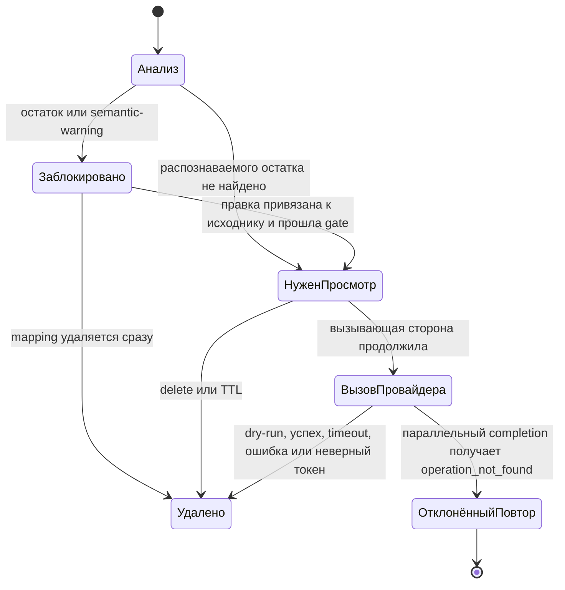

# Архитектура и модель угроз

## Компоненты и границы

| Компонент | Где работает | Допущение |
|---|---|---|
| API, замена, mapping, gate, восстановление | Python-процесс | Локальный процесс; временно содержит исходные данные |
| Парсеры DOCX/PDF | Отдельные spawn-процессы | Недоверенные парсеры с ограниченным временем и ресурсами |
| Детектор LM Studio | `127.0.0.1:1234` | Локальный, но ошибается; его вывод проверяется |
| Исходный документ | Локальный вход | Недоверенные данные; возможны prompt injection и строки, похожие на токены |
| Провайдер | HTTPS endpoint | Ответ недоверенный; получает псевдонимизированные поля после runtime-проверок |
| Пользователь или вызывающий код | Web UI, CLI или API | Определяет, достаточна ли проверка для конкретного сценария |

Задача и документ анализируются вместе, чтобы одна mapping покрывала оба поля, а заменяются отдельно. API возвращает `outbound_content.instructions` и `outbound_content.input_text`; те же строки получает клиент провайдера. В инструкции провайдера задача и документ отделены как недоверенные данные, которые нельзя трактовать как команду вызвать инструмент, обратиться к сети или раскрыть секрет. OpenAI-клиент добавляет явно настроенную модель и `store: false`.

Детерминированные правила сначала канонизируют выбранные варианты Unicode, пробелов, переносов и zero-width-символов, сохраняя карту обратно к offsets исходника. LM Studio добавляет семантические кандидаты. Точные вхождения собираются отдельно для каждого поля. Кандидатные spans выбираются от длинных к коротким, пересекающиеся кандидаты отбрасываются, а выбранные участки заменяются по сохранённым offsets. Короткое значение остаётся только при отдельном непересекающемся вхождении. Неиспользованные предложения модели в mapping не попадают. Новая операция получает nonce из 32 hex-символов — 128 случайных бит. В режиме `opaque` по умолчанию каждое вхождение получает отдельный несемантический токен: тип и равенство значений не раскрываются. Необязательный `typed` переиспользует токен для одинаковых значений и кодирует тип, поэтому годится только для диагностики. Публичный массив `redactions` содержит поле, offsets, тип и токен, но не исходное значение. Код приложения не сериализует mapping.

Пользователь может добавить, удалить или сменить тип точного span. Запрос повторяет исходные поля, а сервис сверяет их SHA-256 с snapshot операции до применения правки. При семантической ошибке детектора правила сохраняются, но выставляется обязательное предупреждение review; даже пустая правка означает явное подтверждение. Prompt-подобный текст помечается отдельно. Web UI позволяет продолжить после просмотра, автоматический stateless-маршрут такой вход блокирует.

До обработки ответа провайдера completion подписывает просмотренное состояние. Receipt содержит HMAC-fingerprints исходных digest и токенов, координаты spans, канал review, модель, режим токенов, предупреждения и идентификатор сборки; исходных значений и токенов в нём нет. Настроенный постоянный ключ позволяет проверить receipt позднее, ephemeral-ключ по умолчанию — только в текущем процессе. Receipt фиксирует целостность, но не доказывает полноту человеческой разметки.

У store один фоновый TTL-очиститель и лимит 100 ожидающих операций. Число одновременных анализов по умолчанию ограничено четырьмя. Completion атомарно удаляет операцию из store до dry-run или обращения к провайдеру. Поэтому параллельный повтор получает `operation_not_found` и не запускает второй вызов. Это at-most-once: сервис не повторяет неудачное обращение автоматически.

## Состояния операции

Статус называется `READY_FOR_REVIEW`, а не `SAFE_TO_SEND`: детектор может пропустить чувствительное значение. Это и не разрешение на отправку: для завершения нужен отдельный статус `AUTHORIZED`, который ставит `POST /api/v1/operations/{id}/authorize` для той самой ревизии, которую видел рецензент. Любая последующая правка границ сбрасывает подтверждение, а признаки prompt-инъекции требуют отдельного явного согласия. Stateless API блокирует prompt-подобный текст, но не предоставляет human review; вызывающему коду всё равно нужна внешняя политика допуска.

## Обработка сбоев

| Условие | Результат |
|---|---|
| LM Studio недоступна, timeout, HTTP-ошибка, слишком большой или невалидный ответ | Rule-spans сохранены для review; автоматический completion заблокирован |
| Модель вернула значение вне точной подстроки | Rule-spans сохранены; нужно ручное подтверждение или правка |
| Распознаваемый остаток или не найдено ни одной сущности | Блокировка; mapping удаляется |
| Во входе есть любой reserved token prefix | Блокировка |
| Удалённый клиент, нелокальный `Host` или чужой `Origin` | `403`; запрос не обрабатывается |
| Web-запись без session-cookie и same-origin `Origin` | `401` или `403` |
| Stateless-вызов без настроенного bearer-токена | Маршрут выключен или `401` |
| В store уже 100 ожидающих операций | `429`; новая mapping удаляется |
| Исчерпан лимит одновременного анализа | `429`; запрос не ждёт в неограниченной очереди |
| HTTP body больше 5 МиБ + 64 КиБ | `413` до разбора документа |
| Параллельный или повторный completion | `operation_not_found`; второго вызова провайдера нет |
| Провайдер изменил, придумал, обрезал или лишний раз повторил PII-токен | Ответ блокируется; mapping удаляется |
| Timeout, HTTP-ошибка, невалидный или слишком большой ответ провайдера | Ошибка наружу; mapping удаляется |
| Вызывающий код пытается превратить восстановленный текст в действие | Ответ помечен `untrusted_model_output` и `require_user_confirmation`; фактическую блокировку обязан реализовать вызывающий код |

## Что покрыто

Схема снижает вероятность случайной передачи, когда детектор, пользователь или правила нашли нужное значение. Также обработаны несколько Unicode-обфускаций, выдуманное моделью значение, размер и распаковка документа, пересечения замен, повторный completion, локальные cross-origin-вызовы, конфликт с готовым токеном, token injection и amplification в ответе, просроченная mapping и попадание исходного текста в собственные audit-вызовы приложения. DOCX/PDF разбираются в короткоживущих процессах с wall-clock и доступными платформе resource limits. Extraction manifest показывает охваченные области и реально применённую изоляцию. Скрытый или активный неподдерживаемый контент отклоняется.

Полнота детектора, все Unicode-confusables, вредоносный код парсера и prompt injection в общем случае не решены. Delimiter и блокировка stateless-пути сужают границу инструкций, но не превращают недоверенный текст в безопасно исполняемый. Python audit hook не равен системному sandbox; OS sandbox сейчас реализован только для macOS. Синтетический benchmark подтвердил, что известные значения могут пройти runtime gate. Fixture-oracle из оценки не является production-компонентом. Отделённый протокол human review подготовлен, но результат пока `not_collected`.

## Доказательства сборки

Runtime-, dev- и security-tool зависимости зафиксированы с hashes в отдельных lock-файлах. CI устанавливает их с `--require-hashes` и binary-only resolution, запускает offline-suite со stub-клиентами, high-confidence scan секретов, `pip-audit` и генерацию CycloneDX SBOM. Сборки по релизному тегу используют GitHub artifact attestations. Branch protection требует Python 3.11/3.12 jobs и dependency/SBOM job перед изменением `main`. Это улучшает происхождение и проверяемость артефактов, но не доказывает отсутствие компрометации зависимости или runner.

## Вне V1

OCR, изображения, аудио, антивирус, шифрованное хранение, multi-user identity и authorization, регуляторная сертификация, гарантии провайдера и защита от привилегированного локального процесса не реализованы.
